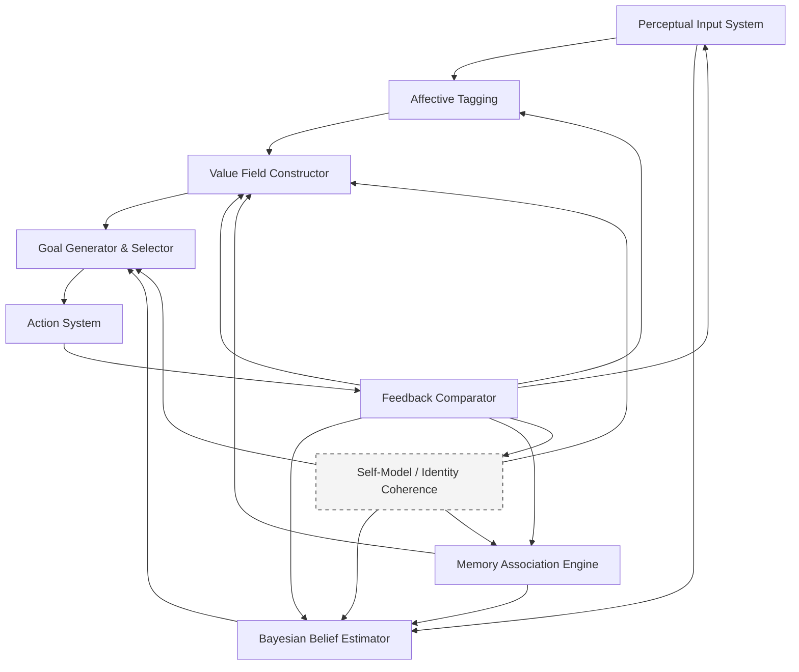

+++
date = '2025-08-05T21:50:33+02:00'
draft = false
title = 'A Model of Emergent Belief, Value, and Goal Formation'
tags = ["cognitive-science", "philosophy", "emergence", "systems-thinking", "cybernetics"]
categories = ["Models of Mind"]
ShowToc = true
TocOpen = true
+++

## Introduction

In the first two posts of *Spatium Novum*, I began by asking what remains to explore when traditional frontiers—scientific, geographic, conceptual—seem mapped or saturated. That led naturally to a second question: how do we orient ourselves internally when the world no longer provides a clear external direction?

I explored goal-making not as a matter of setting destinations, but as a recursive, uncertain process embedded in perception, identity, and context. But as I pushed deeper, a more foundational question emerged:

> **Where do our goals, our beliefs, and our values come from in the first place?**

Not how we optimize them. Not how we plan around them. But how they **emerge**.

Most theories treat beliefs, values, and goals as primitives—as inputs to cognition or decision-making. We’re assumed to “have” beliefs, to “hold” values, and to “choose” goals from a set of options. But this framing assumes what it should explain.

In this post, I want to propose a different view: one where **beliefs, values, and goals are not pre-loaded** but are **generated, filtered, and updated** through recursive interaction between perception, affect, prediction, and feedback.

The goal is to sketch an explicit model—technical, but intuitive—of how this architecture might work. Not as a metaphor, but as a set of interacting processes that can be analyzed, simulated, and potentially disrupted. We’ll build from foundational assumptions, outline the model’s structure, illustrate it with a diagram, and apply it to real-world examples.

This is a post about emergence. About architecture. And about what it means to *generate orientation* when no map is given.

---

## Foundational Assumptions and Core Postulates

### A. Foundational Assumptions

This model begins with five key premises drawn from modern cognitive science, philosophy, and neuroscience:

1.  **Cognition is embedded and embodied:** The mind is not separate from the body or its environment. As argued in foundational works like *The Embodied Mind* (Varela, Thompson, & Rosch), cognitive processes are fundamentally shaped by our physiological states, sensory input, and the body’s capacities for action.
2.  **Perception and action are coupled:** We do not passively receive stimuli. Perception is an active process geared toward potential action. This idea, central to the work of psychologist J.J. Gibson, suggests we perceive "affordances"—opportunities for interaction—rather than abstract data points.
3.  **The brain is a generative prediction machine:** A leading theory in neuroscience posits that organisms maintain models of the world to minimize surprise. Cognition functions via a constant loop of prediction, inference, and error correction. As Andy Clark puts it in *Surfing Uncertainty*, the brain is not a passive analyzer but an active predictor, constantly trying to guess what will happen next based on its internal models.
4.  **Emotion is not noise, but signal:** Affective valence (e.g., pleasure, fear, boredom) provides essential feedback that shapes our values, directs our attention, and evaluates our goals. This insight, powerfully demonstrated by neuroscientist Antonio Damasio in *Descartes' Error*, shows that reason cannot function without emotion. More recent work by Lisa Feldman Barrett in *How Emotions Are Made* suggests that emotions themselves are constructed through the brain's predictive and interoceptive processes, fitting perfectly with an emergent model.
5.  **Goal formation is emergent, not chosen:** Goals do not pre-exist as a menu of options. They emerge from the dynamic interplay of the components above. This aligns with foundational ideas from cybernetics, where pioneers like W. Ross Ashby showed how complex, goal-directed behavior can arise in systems without a central controller, through self-organization and feedback.

### B. Core Postulates of the Model

The model posits the following **irreducible functional components**. These are not “brain regions” but **computational and dynamical roles** played within the cognitive architecture.

1.  **Perceptual Input System:** Captures both exteroceptive (external) and interoceptive (internal) sensory data.
2.  **Affective Tagging Layer:** Assigns emotional salience to incoming data based on bodily state and prior reinforcement.
3.  **Memory Association Engine:** Dynamically retrieves prior experiences, habits, and identity-linked episodes that are relevant to the current context.
4.  **Bayesian Belief Estimator:** Integrates prior beliefs and current evidence using probabilistic inference, updating beliefs as distributions of likelihood rather than binary truths.
5.  **Value Field Constructor:** Weights possible states or outcomes by desirability, which emerges from affective experience, social feedback, and prediction success.
6.  **Goal Generator and Selector:** Proposes and filters possible goals based on perceived affordances, predicted outcomes, and current values.
7.  **Action System:** Executes behaviors, which in turn generate new perceptual data.
8.  **Feedback Comparator:** Monitors the mismatch between predicted and actual outcomes, computing the prediction error that drives learning across the entire system.
9.  **Self-Model and Identity Coherence** *(optional, higher-level):* A narrative layer that tracks the system's identity (“who I am”), influencing what is considered salient, plausible, or worth pursuing.

This system is **non-linear** and **recursive**. There is **no fixed controller**; the system self-organizes continuously.

---

## Visual Diagram — An Emergent Cognitive Architecture

### Notes on Interpretation:

*   The diagram shows an **interactive control system** with **recursive feedback loops**.
*   The **Self-Model** exists at a higher level of abstraction, often emerging only in narrative-conscious agents.
*   Feedback touches everything: **learning, emotion, attention, and identity**.
*   **Value** and **Belief** are not static; they are *continuously revised*.

---

## Real-World Examples of the Model in Motion

### Example 1: A Simple Decision – “Should I speak up in this meeting?”

**Context:** You're in a team meeting with a suggestion, but you're unsure whether to voice it. The internal conflict that arises can be understood as a competition between the fast, intuitive processes (affective tagging, memory retrieval) and the slower, more deliberate ones, a dynamic famously explored by Daniel Kahneman in *Thinking, Fast and Slow*.

| Model Component         | What’s Happening                                                                                                            |
| ----------------------- | --------------------------------------------------------------------------------------------------------------------------- |
| **Perception**          | You register the tone of the conversation, your heartbeat, glances from peers.                                              |
| **Affective Tagging**   | Slight anxiety; a spike of arousal. Your body interprets this as risk.                                                      |
| **Memory Retrieval**    | Recollection of a past meeting where you were misunderstood, versus another where your idea was well received.              |
| **Belief Update**       | Posterior: “If I speak, there’s a moderate risk of discomfort, but a non-zero chance of positive impact.”                   |
| **Value Construction**  | Competing values: (a) social safety vs. (b) intellectual contribution. Based on recent reward history, value (a) dominates. |
| **Goal Generation**     | Two competing goals emerge: (1) stay silent and preserve harmony, or (2) contribute and risk discomfort.                    |
| **Goal Selection**      | Value (a) has more salience → goal (1) is selected. You stay silent.                                                        |
| **Feedback Monitoring** | Someone else makes a similar point and is praised. Emotion shifts. Prediction error spikes.                                 |
| **Belief/Value Update** | New belief: “Next time, the risk may be worth it.” The value of contribution is upgraded.                                   |
| **Identity Coherence**  | You tell yourself: “I want to be someone who speaks when it matters.” This narrative rewires future bias.                   |

### Example 2: Influence & Manipulation – “Why do I suddenly want this supplement?”

**Context:** An Instagram ad from a fitness influencer. The architecture of persuasion often works by hijacking the very loops this model describes, a process detailed in Robert Cialdini's classic book *Influence*. The film *The Social Dilemma* further explores how this is weaponized at scale by digital platforms.

| Model Component       | What’s Happening                                                                                                                                              |
| --------------------- | ------------------------------------------------------------------------------------------------------------------------------------------------------------- |
| **Perception**        | Visually salient, high-contrast ad focused on an idealized body and confident smile.                                                                          |
| **Affective Tagging** | Quick affective tagging: admiration, slight envy, self-comparison. Dopamine is tagged to an *aspirational self*.                                              |
| **Memory Priming**    | Past failed routines and flashes of your ideal body image are brought to mind.                                                                                |
| **Belief Hijack**     | No data is shown, but social proof (the influencer) and selective evidence distort your Bayesian priors, leading to the belief: “This might actually work.”   |
| **Value Reframing**   | Short-term appearance becomes more salient than long-term health. Social approval is prioritized due to the affective charge.                                 |
| **Goal Injection**    | A new goal surfaces: “Order this supplement today,” competing with a standing goal of “buy less this month.”                                                  |
| **Action Execution**  | You click and buy, receiving immediate dopamine reinforcement from a sense of control and anticipation.                                                       |
| **Feedback Delay**    | The real feedback loop (whether the supplement works) is delayed by weeks. The model doesn't self-correct; instead, the belief is reinforced by the purchase. |

### Example 3: Scientific Creativity – “Should I abandon this hypothesis?”

**Context:** A researcher's model is contradicted by new data. The internal struggle highlights the tension between ego and intellectual honesty. This mirrors the large-scale dynamics of "paradigm shifts" described by Thomas S. Kuhn in *The Structure of Scientific Revolutions*, where scientific communities resist new evidence that threatens established models. The personal discomfort is a classic case of Leon Festinger's **cognitive dissonance**.

| Model Component       | What’s Happening                                                                                                                                      |
| --------------------- | ----------------------------------------------------------------------------------------------------------------------------------------------------- |
| **Perception**        | Reading the contradictory dataset; hearing an advisor’s remarks.                                                                                      |
| **Affective Tagging** | Threat response. Data inconsistency is tagged with negative valence. Shame and frustration rise.                                                      |
| **Memory Activation** | Prior failures resurface. Identity-level memories (“I’m someone who gets things right”) are threatened.                                               |
| **Belief Estimation** | Prior belief: “Model X is accurate.” New evidence creates a Bayesian conflict. The system resists updating due to sunk cost and affective dissonance. |
| **Value Activation**  | Competing values emerge: (a) truth and rigor vs. (b) status and ego. The emotional charge makes (b) dominant.                                         |
| **Goal Candidates**   | (1) Re-analyze data to confirm bias. (2) Openly consider abandoning or revising the hypothesis.                                                       |
| **Goal Selection**    | If the identity narrative around intellectual honesty is strong enough, (2) becomes plausible.                                                        |
| **Action Execution**  | You propose a revision. Identity shifts: “Being wrong is part of doing real science.”                                                                 |
| **Feedback Monitor**  | Your advisor praises your openness. The feedback loop reinforces both the belief update *and* the self-model of being rigorous.                       |

---

## Final Synthesis: An Architecture of Emergent Orientation

The journey that began with a question—**"How do we set goals in a mapless world?"**—has led us to a deeper reconsideration of how *orientation* emerges in cognitive systems.

Our initial dissatisfaction with rigid, destination-driven metaphors opened the door to a broader interrogation: Are beliefs, values, and goals truly foundational inputs to our cognition—or might they be **emergent, dynamic, and continuously reshaped** by recursive feedback?

To answer this, we constructed a formal architecture in which:

*   **Beliefs** are not stored propositions, but dynamic estimates—updated as prediction errors accumulate.
*   **Values** are not inherited axioms, but affectively modulated rankings—emerging from embodied interaction.
*   **Goals** are not fixed endpoints, but transient attractors—sculpted by beliefs, values, and the shifting self-model.

This architecture is **non-linear, recursive, and feedback-sensitive**—closer to a cybernetic organism than a Cartesian mind. It resists top-down planning in favour of **adaptive orientation**, integrating perception, affect, memory, belief modulation, goal generation, action, and feedback.

By understanding how our internal landscape of goals and beliefs is formed, we may become more aware of how it is influenced, misaligned, or manipulated. This insight is not just philosophical—it is navigational.

In a world where maps are no longer given, and metrics are often inherited rather than chosen, we need better **compasses**. This model is one attempt to sketch such a compass. It’s not the territory, but it might help us learn to walk through it with open eyes.