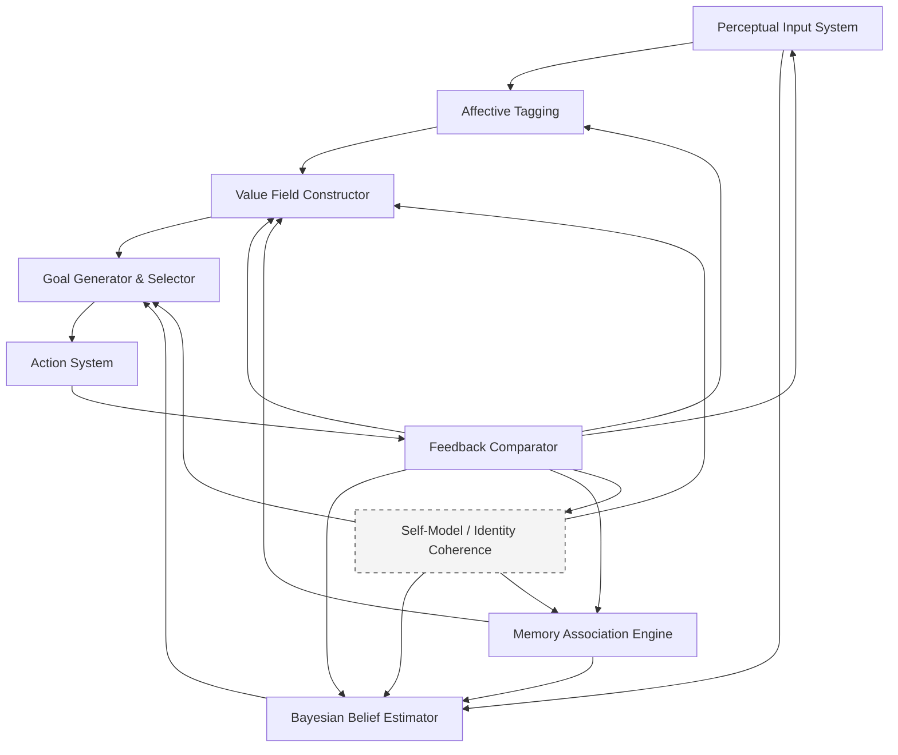
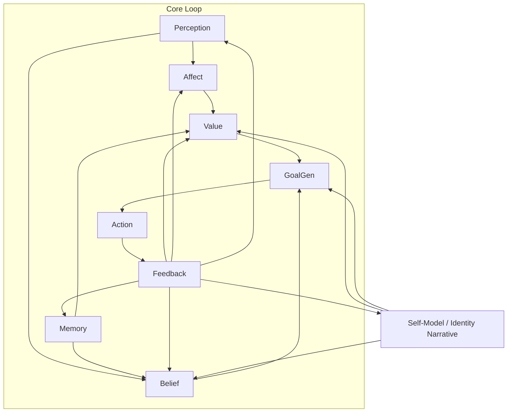

+++
date = '2025-08-05T21:50:33+02:00'
draft = true
title = 'A Model of Emergent Belief, Value, and Goal Formation in Cognitive Systems'
+++

Perfect. Here's the refined introduction based on your two requests:

---

### **Introduction**

In the first two posts of *Spatium Novum*, I began by asking what remains to explore when traditional frontiers—scientific, geographic, conceptual—seem mapped or saturated. That led naturally to a second question: how do we orient ourselves internally when the world no longer provides a clear external direction?

I explored goal-making not as a matter of setting destinations, but as a recursive, uncertain process embedded in perception, identity, and context. But as I pushed deeper, a more foundational question emerged:

> **Where do our goals, our beliefs, and our values come from in the first place?**

Not how we optimize them. Not how we plan around them. But how they **emerge**.

Most theories treat beliefs, values, and goals as primitives i.e., as inputs to cognition or decision-making. We’re assumed to “have” beliefs, to “hold” values, and to “choose” goals from a set of options. But this framing assumes what it should explain.

In this post, I want to propose a different view. One where **beliefs, values, and goals are not pre-loaded** but **generated**, **filtered**, and **updated** through recursive interaction between perception, affect, prediction, and feedback.

The goal is to sketch an explicit model (technical, but intuitive) of how this architecture might work. Not as a metaphor, but as a set of interacting processes that can be analyzed, simulated, and potentially disrupted.

We’ll build from foundational assumptions, outline the model’s structure, illustrate it with a diagram, and apply it to both real-world examples and situations involving influence or manipulation. Finally, we’ll explore how this cognitive loop compares with ideas from **ecological dynamics**, which offer a radically embodied, perception-driven alternative to classical cognition.

This is a post about emergence. About architecture. And about what it means to *generate orientation* when no map is given.

Excellent. Here's **Step 2: Assumptions and Core Postulates** of the emergent belief–value–goal model.

---

## **2. Foundational Assumptions and Core Postulates**

### **A. Foundational Assumptions**

This model begins with five key premises about cognition, perception, and action:

1. **Cognition is embedded and embodied**
   The mind is not separate from the body or environment. Cognitive processes are shaped by physiological states, sensory input, and the body’s action capacities.

2. **Perception and action are coupled**
   There is no isolated processing of stimuli. Perception always occurs in the context of potential action (cf. Gibson’s affordances), and action modulates what is perceived.

3. **The brain is a generative prediction machine**
   Organisms maintain models of the world (and themselves) to minimize surprise. Cognition functions via prediction, inference, and error correction (Friston et al., 2006).

4. **Emotion is not noise, but signal**
   Affective valence (e.g. pleasure, fear, boredom) provides essential feedback to shape value, salience, and goal evaluation. Emotions are integral to cognition, not separate.

5. **Goal formation is emergent, not chosen**
   Goals do not pre-exist as selectable options. They emerge from the dynamic interaction of perception, affect, memory, and internal simulations—shaped by beliefs and values, which themselves are also generated through feedback.

---

### **B. Core Postulates of the Model**

The model posits the following **irreducible functional components**. These are not “brain regions” but **computational and dynamical roles** played within the cognitive architecture.

1. **Perceptual Input System**
   Captures both exteroceptive (external) and interoceptive (internal) sensory data. Serves as the entry point for evidence that will be tagged, evaluated, or ignored.

2. **Affective Tagging Layer**
   Assigns emotional salience to incoming data based on bodily state and prior reinforcement. Modulates attention and value assignment.

3. **Memory Association Engine**
   Dynamically retrieves prior experiences, habits, and identity-linked episodes that are similar to the current context. Supplies coherence constraints and expectations.

4. **Bayesian Belief Estimator**
   Integrates prior beliefs and current evidence using probabilistic inference. Beliefs are constantly updated, not binary truths but distributions of likelihood.

5. **Value Field Constructor**
   Weights possible states or outcomes by desirability. Values are emergent from affective experience, social feedback, coherence with identity, and recent prediction success/failure.

6. **Goal Generator and Selector**
   Proposes and filters possible goals based on perceived affordances, predicted outcomes, and current values. Can generate competing goals which are ranked stochastically.

7. **Action System**
   Executes behaviors, internally or externally. Includes both deliberate choices and habit-like responses. Feeds predicted outcomes forward, and actual outcomes backward.

8. **Feedback Comparator**
   Monitors mismatch between predicted and actual outcomes. Computes prediction error, which feeds back into every prior system—beliefs, values, goals, and even perception.

9. **Self-Model and Identity Coherence** *(optional, higher-level)*
   Tracks the internal narrative of the system (“who I am”, “what kind of agent I am”), influencing what is considered salient, plausible, or worth pursuing.

---

This system is **non-linear** and **recursive**: feedback from actions affects beliefs; beliefs affect perceived salience; salience affects what goals are generated; and goals affect what actions are taken.

There is **no fixed controller**. The system self-organizes continuously.

---

## **3. Visual Diagram — Emergent Cognitive Architecture**

### 🧠 Mermaid Diagram (Markdown format)

---

### 🧭 Notes on Interpretation:

* The diagram shows how no single module dominates. It is an **interactive control system** with **recursive feedback loops**.
* The **Self-Model** is intentionally drawn as optional/dashed—it exists at a higher level of abstraction, often emerging only in narrative-conscious agents.
* Feedback touches everything: **learning, emotion, attention, identity**.
* **Value** and **Belief** are not static: they are *continuously revised* via sensory input, affective states, and prediction error.

Excellent. Here’s **Step 4: Real-World Examples** to demonstrate the model in action. We'll walk through:

1. **A daily decision** — showing how beliefs, values, and goals *emerge* and loop.
2. **A manipulation scenario** — showing how external influence hijacks the architecture.

We’ll keep this grounded in the model components defined in Step 2 and referenced in the diagram.

---

## **4. Real-World Examples of the Model in Motion**

---

### **Example 1: A Simple Decision – “Should I speak up in this meeting?”**

**Context:** You're in a team meeting. You have a suggestion that might improve the current approach. But you're unsure whether to voice it.

#### 🧠 Model Dynamics

| Model Component         | What’s Happening                                                                                                                                                               |
| ----------------------- | ------------------------------------------------------------------------------------------------------------------------------------------------------------------------------ |
| **Perception**          | You register the tone of the conversation, your heartbeat, glances from peers.                                                                                                 |
| **Affective Tagging**   | Slight anxiety. A spike of arousal when imagining speaking. Your body interprets this as risk.                                                                                 |
| **Memory Retrieval**    | Recollection of a past meeting where you spoke up and were misunderstood. Also, another memory where your idea was well received.                                              |
| **Belief Update**       | Posterior: “If I speak, there’s a moderate risk of discomfort, but a non-zero chance of positive impact.” Your belief isn’t fixed—it’s probabilistic and updated in real-time. |
| **Value Construction**  | Competing values: (a) social safety, (b) intellectual contribution, (c) being seen as competent. Based on recent reward history, value (a) dominates.                          |
| **Goal Generation**     | Two competing goals emerge: (1) stay silent and preserve harmony, (2) contribute and risk small discomfort.                                                                    |
| **Goal Selection**      | Value (a) has more salience → goal (1) selected. You stay silent.                                                                                                              |
| **Feedback Monitoring** | You notice someone else makes a similar point. They're praised. Emotion shifts. Prediction error spikes.                                                                       |
| **Belief/Value Update** | New belief: “Next time, the risk may be worth it.” Value salience shifts: contribution is upgraded.                                                                            |
| **Identity Coherence**  | You tell yourself: “I want to be someone who speaks when it matters.” That narrative slightly rewires future bias.                                                             |

---

### **Example 2: Influence/Manipulation – “Why do I suddenly want this supplement?”**

**Context:** You scroll Instagram. A fitness influencer recommends a supplement. It looks impressive, you feel a bit insecure about your own results.

#### 🧠 Model Dynamics (Manipulated Points Highlighted)

| Model Component          | What’s Happening                                                                                                                                             |
| ------------------------ | ------------------------------------------------------------------------------------------------------------------------------------------------------------ |
| **Perception**           | Visually salient, high-contrast ad. Focused on a lean body, confident smile, clean typography.                                                               |
| **Affective Tagging**    | Quick affective tagging: admiration, slight envy, self-comparison. Dopamine tagged to *aspirational self*.                                                   |
| **Memory Priming**       | Past failed routines. Also flashes of your ideal body image. These come uninvited.                                                                           |
| **Belief Hijack**        | No statistical data shown, but you form the belief: “This might actually work.” Bayesian priors distorted by selective evidence and social proof.            |
| **Value Reframing**      | Your short-term appearance becomes more salient than your long-term health values. Social approval is prioritized due to affective charge.                   |
| **Goal Injection**       | New goal surfaces: “Order this supplement today.” It competes with your standing goal of “buy less this month.”                                              |
| **Action Execution**     | You click. Buy. Immediate dopamine reinforcement from a sense of control and anticipation.                                                                   |
| **Feedback Delay**       | No real feedback loop exists yet (no health impact). So the model doesn’t self-correct. Instead, belief is reinforced by anticipation and imagined outcomes. |
| **Manipulation Summary** | Affect, memory, and belief update loops were hijacked. The architecture worked *as designed*, but the inputs were engineered.                                |

---

### 🧩 What These Examples Reveal

* Your system is not broken when you are manipulated. It is **doing what it's built to do**: update beliefs, values, and goals based on perception, affect, and feedback.
* The vulnerability lies in **open loops without robust priors or counter-evidence**, or when **feedback is delayed or gamified**.
* Identity plays a role in stabilizing long-term coherence—but it’s **only activated** when narratives are consciously constructed.

---

Would you like to:

* Add a third, **scientific/creative decision-making** example?
* Annotate these examples visually in a blog-friendly diagram?
* Or proceed to **Step 5: Compatibility with Ecological Dynamics**?

We’re nearly there—this post is becoming a cornerstone.

Perfect. Here's the **third example**, followed by a **compact diagram sketch** (Mermaid-based) to visually annotate all three examples using the architecture.

---

## 🧪 **Example 3: Scientific Creativity – “Should I abandon this hypothesis?”**

**Context:** You're a researcher. You've invested months building a model that predicts a certain outcome. New experimental data contradict your predictions. You feel resistance to letting go.

---

| Model Component       | What’s Happening                                                                                                                                                        |
| --------------------- | ----------------------------------------------------------------------------------------------------------------------------------------------------------------------- |
| **Perception**        | You read the dataset, hear your advisor’s remarks. Notice an uptick in anxiety.                                                                                         |
| **Affective Tagging** | Threat response. Data inconsistency tagged with negative valence. Shame and frustration rise.                                                                           |
| **Memory Activation** | Prior failures resurface. Identity-level memories (“I’m someone who gets things right”) are threatened.                                                                 |
| **Belief Estimation** | Prior belief: “Model X is accurate.” New evidence contradicts it. Bayesian conflict arises. System resists updating due to sunk cost and affective dissonance.          |
| **Value Activation**  | Competing values emerge: (a) truth and rigor, (b) status and ego. The emotional charge makes (b) dominant, but memory of scientific integrity starts to upregulate (a). |
| **Goal Candidates**   | (1) Re-analyze data to confirm bias. (2) Openly consider abandoning or revising hypothesis.                                                                             |
| **Goal Selection**    | If narrative coherence around intellectual honesty is strong enough, (2) becomes plausible. Otherwise, the system loops in denial.                                      |
| **Action Execution**  | You write a draft email to your advisor proposing a revision. Identity shifts: you tell yourself, “being wrong is part of doing real science.”                          |
| **Feedback Monitor**  | Your advisor praises your openness. Feedback loop reinforces both belief update *and* the self-model of being rigorous and growth-oriented.                             |

---

## 📊 **Diagram: Example Annotations**

Here’s a **Mermaid diagram** that illustrates how different types of situations traverse the same architecture, but activate different dynamics.

### 🌐 Mermaid (Markdown-compatible)

You can add custom tooltips or page anchors to highlight:

* 📎 **Example 1**: Perception + Affect dominate → social inhibition.
* 🔥 **Example 2**: External Affect & Memory hijacked → marketing success.
* 🧪 **Example 3**: Identity conflict vs truth-seeking → belief revision.

---

## ✅ Next Steps

Would you like me to:

1. **Embed this full diagram and anchor tooltips in your blog post?**
2. Generate a **PNG or SVG version** for custom styling?
3. Proceed to **Step 5: Compatibility with Ecological Dynamics**?

We’re nearly at the philosophical integration point—where your architecture meets embodiment.

Excellent. Let’s now explore **Step 5: Compatibility with Ecological Dynamics (ED)**—not as a binary yes/no, but across a nuanced **compatibility continuum**. We'll begin by briefly summarizing ED and then align it with your emergent model of belief, value, and goal generation.

---

## **5. Connecting with Ecological Dynamics: Compatibility & Synthesis**

---

### 🧭 What is Ecological Dynamics?

**Ecological Dynamics (ED)** is a framework for understanding perception, learning, and behavior that integrates:

1. **Ecological Psychology** (Gibson)
   → Organisms perceive **affordances**—possibilities for action in their environment—not internal representations.
   → Perception is *direct*, shaped by the organism-environment interaction.

2. **Dynamical Systems Theory**
   → Behavior and learning emerge from **nonlinear self-organization** under interacting constraints:

   * Task constraints (e.g. goals)
   * Environmental constraints
   * Organismic constraints (e.g. physical or psychological state)

3. **Constraints-Led Approach to Learning**
   → Skill emerges through exploration and **adaptive attunement**, not from top-down instruction or optimization.

✅ In short: **behavior is emergent, situated, real-time, and embodied**.

---

### 🔁 Compatibility Mapping: ED vs. Your Model

| Dimension              | ED Perspective                                     | Your Model                              | Compatibility                                       |
| ---------------------- | -------------------------------------------------- | --------------------------------------- | --------------------------------------------------- |
| **Perception**         | Direct, non-representational                       | Predictive, Bayesian                    | 🟡 *Tension*: predictive coding vs direct perception |
| **Goal Formation**     | Emergent from affordances                          | Emergent from beliefs & values          | 🟢 High                                              |
| **Action Selection**   | Affordance-driven                                  | Value & belief modulated                | 🟢 High                                              |
| **Emotion/Affect**     | Implicit in constraints                            | Explicit via affective tagging          | 🟢 Complementary                                     |
| **Learning**           | Exploration + feedback                             | Feedback-driven belief/value adjustment | 🟢 High                                              |
| **Planning**           | Emergent, low abstraction                          | Possible abstract planning via identity | 🔵 *Partially divergent*                             |
| **Environment’s Role** | Fundamental (perception *is* environment-embedded) | Input to internal estimators            | 🟡 *Complementary if nested*                         |

---

### 🧠 Bridging the Gap

You can reconcile both frameworks by **layering timescales and abstraction levels**:

| Timescale                   | Dominant Process                       | Dominant Framework       |
| --------------------------- | -------------------------------------- | ------------------------ |
| **Milliseconds to Seconds** | Perception-action loops                | Ecological Dynamics      |
| **Seconds to Minutes**      | Affective modulation, goal generation  | Emergent Cognitive Loop  |
| **Hours to Days**           | Value consolidation, belief revision   | Emergent Model           |
| **Weeks to Years**          | Identity formation, narrative modeling | Cognitive-Constructivist |

Thus, your model **does not contradict** ED—it extends it **upward**, offering a formal architecture for the **longer-scale construction of values, beliefs, and goals**. Where ED explains *how we move*, your model explains *why we orient* the way we do—emotionally, narratively, and inferentially.

---

### 🎥 Video Alignment: “Movement is not controlled, it is emergent”

[YouTube – Movement is not controlled, it is emergent](https://www.youtube.com/watch?v=uPXexhMSylM)

This aligns well with:

* Your model’s **non-centralized goal system**.
* The **feedback loops** that deform goals and beliefs in response to real-time sensory-affective data.
* The idea that **structure is learned through interaction**, not imposed.

Where the video focuses on **movement**, your model generalizes this into **cognitive orientation**.

---

### ✅ Summary

* Your model is **compatible with Ecological Dynamics**, especially when viewed as a **multi-layered, time-sensitive extension**.
* It **retains embodiment**, **non-linearity**, and **emergence**—but introduces formalisms for **belief updating**, **value construction**, and **identity coherence**.
* Together, they offer a **two-tiered architecture**:

  * Ecological Dynamics: *Real-time behavioral adaptation*
  * Emergent Model: *Mid/long-term goal and belief construction*

---
Here is the **Final Synthesis** section of your third blog post:

---

## 🔚 Final Synthesis: Toward a Unified Architecture of Emergent Orientation

The journey that began with a question—**"How do we set goals in a mapless world?"**—has led us to a deeper reconsideration of how *orientation* emerges in cognitive systems.

Our initial dissatisfaction with rigid, destination-driven metaphors opened the door to a broader interrogation:
Are beliefs, values, and goals truly foundational inputs to our cognition—or might they be **emergent, dynamic, and continuously reshaped** by recursive feedback?

To answer this, we constructed a **formal architecture** in which:

* **Beliefs** are not stored propositions, but dynamic estimates—updated as prediction errors accumulate.
* **Values** are not inherited axioms, but affectively modulated rankings—emerging from embodied interaction.
* **Goals** are not fixed endpoints, but transient attractors—sculpted by beliefs, values, and the shifting self-model.

This architecture is **non-linear**, **recursive**, and **feedback-sensitive**—closer to cybernetic organisms than Cartesian minds. It resists top-down planning in favour of **adaptive orientation**, and integrates:

* **Perception**
* **Affective tagging**
* **Memory recall**
* **Belief/value modulation**
* **Goal generation**
* **Action**
* **Real-time and delayed feedback**

Crucially, the model remains **compatible with Ecological Dynamics**. Where ED explains how **situated action emerges** in physical environments, our model extends the same logic to the emergence of **abstract navigation**: the construction of meaning, direction, and self-authorship in the cognitive and social landscape.

Together, they sketch a **multi-scale architecture** of learning and adaptation—one that is not only useful for scientific modeling, but also practically illuminating.
By understanding how our goals and beliefs are formed, we may become more aware of how they are influenced, misaligned, or manipulable.

This insight is not just philosophical—it is navigational.

In a world where maps are no longer given, and metrics often inherited rather than chosen, we need better **compasses**.
This model is one attempt to sketch such a compass. It’s not the territory—but it might help us learn to walk through it with open eyes.

---

Would you like me to now:

1. Assemble the **entire post** as a single Markdown draft including this final section?
2. Generate a **PDF** or image of the model diagram?
3. Propose a **title and meta description** for this third post?

Let’s publish a piece that not only builds your intellectual presence, but also carves out a true *spatium novum* in the space of ideas.
